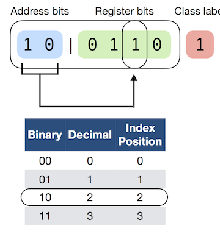

# Make Multiplexer Dataset

Function that creates a dataset generated by a n-bit Boolean multiplexer for evaluating supervised learning algorithms.

> `from mlxtend.data import make_multiplexer_dataset`    

## Overview

The `make_multiplexer_dataset` function creates a dataset generated by an n-bit Boolean multiplexer. Such dataset represents a dataset generated by a simple rule, based on the behavior of a electric multiplexer, yet presents a relatively challenging classification problem for supervised learning algorithm with interactions between features (epistasis) as it may be encountered in many real-world scenarios [1].

The following illustration depicts a 6-bit multiplexer that consists of 2 address bits and 4 register bits. The address bits converted to decimal representation point to a position in the register bit. For example, if the address bits are "00" (0 in decimal), the address bits point to the register bit at position 0. The value of the register position pointed to determines the class label. For example, if the register bit at position is 0, the class label is 0. Vice versa, if the register bit at position 0 is 1, the class label is 1. 




In the example above, the address bits "10" (2 in decimal) point to the 3rd register position (as we start counting from index 0), which has a bit value of 1. Hence, the class label is 1.

Below are a few more examples:

1. Address bits: [0, 1], register bits: [1, 0, 1, 1], class label: 0
2. Address bits: [0, 1], register bits: [1, 1, 1, 0], class label: 1
3. Address bits: [1, 0], register bits: [1, 0, 0, 1], class label: 0
4. Address bits: [1, 1], register bits: [1, 1, 1, 0], class label: 0
5. Address bits: [0, 1], register bits: [0, 1, 1, 0], class label: 1
6. Address bits: [0, 1], register bits: [1, 0, 0, 1], class label: 0
7. Address bits: [0, 1], register bits: [0, 1, 1, 1], class label: 1
8. Address bits: [0, 1], register bits: [0, 0, 0, 0], class label: 0
9. Address bits: [1, 0], register bits: [1, 0, 1, 1], class label: 1
10. Address bits: [0, 1], register bits: [1, 1, 1, 1], class label: 1

Note that in the implementation of the multiplexer function, if the number of address bits is set to 2, this results in a 6 bit multiplexer as two bit can have 2^2=4 different register positions (2 bit + 4 bit = 6 bit). However, if we choose 3 address bits instead, 2^3=8 positions would be covered, resulting in a 11 bit (3 bit + 8 bit = 11 bit) multiplexer, and so forth.


### References

- [1]  Urbanowicz, R. J., & Browne, W. N. (2017). *Introduction to Learning Classifier Systems*. Springer.

## Example 1 -- 6-bit multiplexer

This simple example illustrates how to create dataset from a 6-bit multiplexer


```python
import numpy as np
from mlxtend.data import make_multiplexer_dataset


X, y = make_multiplexer_dataset(address_bits=2, 
                                sample_size=10,
                                positive_class_ratio=0.5, 
                                shuffle=False,
                                random_seed=123)

print('Features:\n', X)
print('\nClass labels:\n', y)
```

    Features:
     [[0 1 0 1 0 1]
     [1 0 0 0 1 1]
     [0 1 1 1 0 0]
     [0 1 1 1 0 0]
     [0 0 1 1 0 0]
     [0 1 0 0 0 0]
     [0 1 1 0 1 1]
     [1 0 1 0 0 0]
     [1 0 0 1 0 1]
     [1 0 1 0 0 1]]
    
    Class labels:
     [1 1 1 1 1 0 0 0 0 0]


## API


*make_multiplexer_dataset(address_bits=2, sample_size=100, positive_class_ratio=0.5, shuffle=False, random_seed=None)*

Function to create a binary n-bit multiplexer dataset.

New in mlxtend v0.9

**Parameters**

- `address_bits` : int (default: 2)

    A positive integer that determines the number of address
    bits in the multiplexer, which in turn determine the
    n-bit capacity of the multiplexer and therefore the
    number of features. The number of features is determined by
    the number of address bits. For example, 2 address bits
    will result in a 6 bit multiplexer and consequently
    6 features (2 + 2^2 = 6). If `address_bits=3`, then
    this results in an 11-bit multiplexer as (2 + 2^3 = 11)
    with 11 features.


- `sample_size` : int (default: 100)

    The total number of samples generated.


- `positive_class_ratio` : float (default: 0.5)

    The fraction (a float between 0 and 1)
    of samples in the `sample_size`d dataset
    that have class label 1.
    If `positive_class_ratio=0.5` (default), then
    the ratio of class 0 and class 1 samples is perfectly balanced.


- `shuffle` : Bool (default: False)

    Whether or not to shuffle the features and labels.
    If `False` (default), the samples are returned in sorted
    order starting with `sample_size`/2 samples with class label 0
    and followed by `sample_size`/2 samples with class label 1.


- `random_seed` : int (default: None)

    Random seed used for generating the multiplexer samples and shuffling.

**Returns**

- `X, y` : [n_samples, n_features], [n_class_labels]

    X is the feature matrix with the number of samples equal
    to `sample_size`. The number of features is determined by
    the number of address bits. For instance, 2 address bits
    will result in a 6 bit multiplexer and consequently
    6 features (2 + 2^2 = 6).
    All features are binary (values in {0, 1}).
    y is a 1-dimensional array of class labels in {0, 1}.

**Examples**

For usage examples, please see
    [http://rasbt.github.io/mlxtend/user_guide/data/make_multiplexer_dataset](http://rasbt.github.io/mlxtend/user_guide/data/make_multiplexer_dataset)


