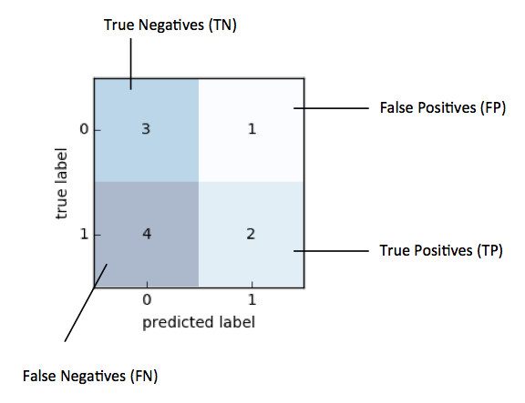

# Lift Score

Scoring function to compute the LIFT metric, the ratio of correctly predicted positive examples and the actual positive examples in the test dataset.

> `from mlxtend.evaluate import lift_score`    

## Overview

In the context of classification, *lift* [1] compares model predictions to randomly generated predictions. Lift is often used in marketing research combined with *gain and lift* charts as a visual aid [2]. For example, assuming a 10% customer response as a baseline, a lift value of 3 would correspond to a 30% customer response when using the predictive model. Note that *lift* has the range $\lbrack 0, \infty \rbrack$.

There are many strategies to compute *lift*, and below, we will illustrate the computation of the lift score using a classic confusion matrix. For instance, let's assume the following prediction and target labels, where "1" is the positive class:

- $\text{true labels}: [0, 0, 1, 0, 0, 1, 1, 1, 1, 1]$
- $\text{prediction}: [1, 0, 1, 0, 0, 0, 0, 1, 0, 0]$

Then, our confusion matrix would look as follows:



Based on the confusion matrix above, with "1" as positive label, we compute *lift* as follows:

$$
\text{lift} = \frac{(TP/(TP+FP)}{(TP+FN)/(TP+TN+FP+FN)}
$$

Plugging in the actual values from the example above, we arrive at the following lift value:

$$
\frac{2/(2+1)}{(2+4)/(2+3+1+4)} = 1.1111111111111112
$$

An alternative way to computing lift is by using the *support* metric [3]:

$$
\text{lift} = \frac{\text{support}(\text{true labels} \cap \text{prediction})}{\text{support}(\text{true labels}) \times \text{support}(\text{prediction})},
$$

Support is $x / N$, where $x$ is the number of incidences of an observation and $N$ is the total number of samples in the datset. $\text{true labels} \cap \text{prediction}$ are the true positives, $true labels$ are true positives plus false negatives, and $prediction$ are true positives plus false positives. Plugging the values from our example into the equation above, we arrive at:

$$
\frac{2/10}{(6/10 \times 3/10)} = 1.1111111111111112
$$


### References

- [1]  S. Brin, R. Motwani, J. D. Ullman, and S. Tsur. [Dynamic itemset counting and implication rules for market basket data](http://dl.acm.org/citation.cfm?id=253325). In Proc. of the ACM SIGMOD Int'l Conf. on Management of Data (ACM SIGMOD '97), pages 265-276, 1997.
- [2] https://www3.nd.edu/~busiforc/Lift_chart.html
- [3] https://en.wikipedia.org/wiki/Association_rule_learning#Support

## Example 1 - Computing Lift

This examples demonstrates the basic use of the `lift_score` function using the example from the *Overview* section.


```python
import numpy as np
from mlxtend.evaluate import lift_score

y_target =    np.array([0, 0, 1, 0, 0, 1, 1, 1, 1, 1])
y_predicted = np.array([1, 0, 1, 0, 0, 0, 0, 1, 0, 0])

lift_score(y_target, y_predicted)
```


    1.1111111111111112


## Example 2 - Using `lift_score` in `GridSearch`

The `lift_score` function can also be used with scikit-learn objects, such as `GridSearch`:


```python
from sklearn.datasets import load_iris
from sklearn.model_selection import train_test_split
from sklearn.model_selection import GridSearchCV
from sklearn.svm import SVC
from sklearn.metrics import make_scorer

# make custom scorer
lift_scorer = make_scorer(lift_score)


iris = load_iris()
X, y = iris.data, iris.target

X_train, X_test, y_train, y_test = train_test_split(
    X, y, test_size=0.2, stratify=y, random_state=123)

hyperparameters = [{'kernel': ['rbf'], 'gamma': [1e-3, 1e-4],
                     'C': [1, 10, 100, 1000]},
                   {'kernel': ['linear'], 'C': [1, 10, 100, 1000]}]

clf = GridSearchCV(SVC(), hyperparameters, cv=10,
                   scoring=lift_scorer)
clf.fit(X_train, y_train)

print(clf.best_score_)
print(clf.best_params_)
```

    3.0
    {'gamma': 0.001, 'kernel': 'rbf', 'C': 1000}


## API


*lift_score(y_target, y_predicted, binary=True, positive_label=1)*

Lift measures the degree to which the predictions of a
classification model are better than randomly-generated predictions.

The in terms of True Positives (TP), True Negatives (TN),
False Positives (FP), and False Negatives (FN), the lift score is
computed as:
[ TP/(TP+FN) ] / [ (TP+FP) / (TP+TN+FP+FN) ]


**Parameters**

- `y_target` : array-like, shape=[n_samples]

    True class labels.

- `y_predicted` : array-like, shape=[n_samples]

    Predicted class labels.

- `binary` : bool (default: True)

    Maps a multi-class problem onto a
    binary, where
    the positive class is 1 and
    all other classes are 0.

- `positive_label` : int (default: 0)

    Class label of the positive class.

**Returns**

- `score` : float

    Lift score in the range [0, $\infty$]

**Examples**

For usage examples, please see
    [http://rasbt.github.io/mlxtend/user_guide/evaluate/lift_score/](http://rasbt.github.io/mlxtend/user_guide/evaluate/lift_score/)


