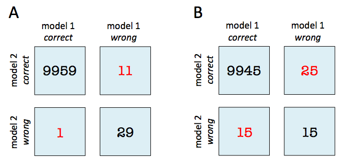
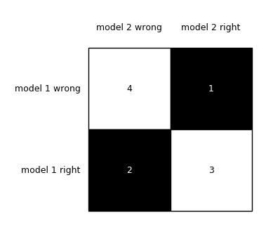

# Contigency Table for McNemar's Test

Function to compute a 2x2 contingency table for McNemar's Test

> `from mlxtend.evaluate import mcnemar_table`    

## Overview

###  Contigency Table for McNemar's Test

A 2x2 contigency table as being used in a McNemar's Test ([`mlxtend.evaluate.mcnemar`](mcnemar.md)) is a useful aid for comparing two different models. In contrast to a typical confusion matrix, this table compares two models to each other rather than showing the false positives, true positives, false negatives, and true negatives of a single model's predictions:


For instance, given that 2 models have a accuracy of with a 99.7% and 99.6% a 2x2 contigency table can provide further insights for model selection.




In both subfigure A and B, the predictive accuracies of the two models are as follows:

- model 1 accuracy: 9,960 / 10,000 = 99.6%
- model 2 accuracy: 9,970 / 10,000 = 99.7%

Now, in subfigure A, we can see that model 2 got 11 predictions right that model 1 got wrong. Vice versa, model 2 got 1 prediction right that model 2 got wrong. Thus, based on this 11:1 ratio, we may conclude that model 2 performs substantially better than model 1. However, in subfigure B, the ratio is 25:15, which is less conclusive about which model is the better one to choose.

### References

- McNemar, Quinn, 1947. "[Note on the sampling error of the difference between correlated proportions or percentages](http://link.springer.com/article/10.1007%2FBF02295996)". Psychometrika. 12 (2): 153–157.
- Edwards AL: Note on the “correction for continuity” in testing the significance of the difference between correlated proportions. Psychometrika. 1948, 13 (3): 185-187. 10.1007/BF02289261.
- https://en.wikipedia.org/wiki/McNemar%27s_test


## Example 2 - 2x2 Contigency Table


```python
import numpy as np
from mlxtend.evaluate import mcnemar_table

y_true = np.array([0, 0, 0, 0, 0, 1, 1, 1, 1, 1])

y_mod1 = np.array([0, 1, 0, 0, 0, 1, 1, 0, 0, 0])
y_mod2 = np.array([0, 0, 1, 1, 0, 1, 1, 0, 0, 0])

tb = mcnemar_table(y_target=y_true, 
                   y_model1=y_mod1, 
                   y_model2=y_mod2)

tb
```


    array([[4, 1],
           [2, 3]])


To visualize (and better interpret) the contigency table via matplotlib, we can use the `checkerboard_plot` function:


```python
from mlxtend.plotting import checkerboard_plot
import matplotlib.pyplot as plt

brd = checkerboard_plot(tb,
                        figsize=(3, 3),
                        fmt='%d',
                        col_labels=['model 2 wrong', 'model 2 right'],
                        row_labels=['model 1 wrong', 'model 1 right'])
plt.show()
```





## API


*mcnemar_table(y_target, y_model1, y_model2)*

Compute a 2x2 contigency table for McNemar's test.

**Parameters**

- `y_target` : array-like, shape=[n_samples]

    True class labels as 1D NumPy array.

- `y_model1` : array-like, shape=[n_samples]

    Predicted class labels from model as 1D NumPy array.

- `y_model2` : array-like, shape=[n_samples]

    Predicted class labels from model 2 as 1D NumPy array.

**Returns**

- `tb` : array-like, shape=[2, 2]

    2x2 contingency table with the following contents:
    a: tb[0, 0]: # of samples that both models predicted correctly
    b: tb[0, 1]: # of samples that model 1 got right and model 2 got wrong
    c: tb[1, 0]: # of samples that model 2 got right and model 1 got wrong
    d: tb[1, 1]: # of samples that both models predicted incorrectly

**Examples**

For usage examples, please see
    [http://rasbt.github.io/mlxtend/user_guide/evaluate/mcnemar_table/](http://rasbt.github.io/mlxtend/user_guide/evaluate/mcnemar_table/)


