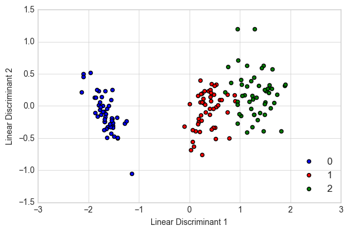
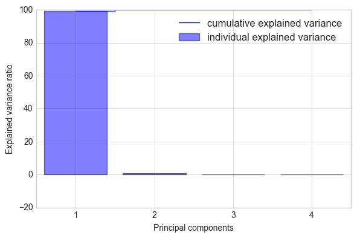

# Linear Discriminant Analysis

Implementation of Linear Discriminant Analysis for dimensionality reduction

> from mlxtend.feature_extraction import LinearDiscriminantAnalysis

## Overview

Linear Discriminant Analysis (LDA) is most commonly used as dimensionality reduction technique in the pre-processing step for pattern-classification and machine learning applications.
The goal is to project a dataset onto a lower-dimensional space with good class-separability in order avoid overfitting ("curse of dimensionality") and also reduce computational costs.

Ronald A. Fisher formulated the *Linear Discriminant* in 1936 ([The Use of Multiple  Measurements in Taxonomic Problems](http://onlinelibrary.wiley.com/doi/10.1111/j.1469-1809.1936.tb02137.x/abstract)), and it also has some practical uses as classifier. The original Linear discriminant was described for a 2-class problem, and it was then later generalized as "multi-class Linear Discriminant Analysis" or "Multiple Discriminant Analysis" by C. R. Rao in 1948 ([The utilization of multiple measurements in problems of biological classification](http://www.jstor.org/stable/2983775))

**The general LDA approach is very similar to a Principal Component Analysis, but in addition to finding the component axes that maximize the variance of our data (PCA), we are additionally interested in the axes that maximize the separation between multiple classes (LDA).**

So, in a nutshell, often the goal of an LDA is to project a feature space (a dataset n-dimensional samples) onto a smaller subspace $k$ (where $k \leq n-1$) while maintaining the class-discriminatory information.   
In general, dimensionality reduction does not only help reducing computational costs for a given classification task, but it can also be helpful to avoid overfitting by minimizing the error in parameter estimation ("curse of dimensionality").

#### Summarizing the LDA approach in 5 steps


Listed below are the 5 general steps for performing a linear discriminant analysis.

1. Compute the $d$-dimensional mean vectors for the different classes from the dataset.
2. Compute the scatter matrices (in-between-class and within-class scatter matrix).
3. Compute the eigenvectors ($\mathbf{e_1}, \; \mathbf{e_2}, \; ..., \; \mathbf{e_d}$) and corresponding eigenvalues ($\mathbf{\lambda_1}, \; \mathbf{\lambda_2}, \; ..., \; \mathbf{\lambda_d}$) for the scatter matrices.
4. Sort the eigenvectors by decreasing eigenvalues and choose $k$ eigenvectors with the largest eigenvalues to form a $k \times d$ dimensional matrix $\mathbf{W}$ (where every column represents an eigenvector).
5. Use this $k \times d$ eigenvector matrix to transform the samples onto the new subspace. This can be summarized by the mathematical equation: $\mathbf{Y} = \mathbf{X} \times \mathbf{W}$ (where $\mathbf{X}$ is a $n \times d$-dimensional matrix representing the $n$ samples, and $\mathbf{y}$ are the transformed $n \times k$-dimensional samples in the new subspace).

### References

- Fisher, Ronald A. "[The use of multiple measurements in taxonomic problems.](http://onlinelibrary.wiley.com/doi/10.1111/j.1469-1809.1936.tb02137.x/abstract)" Annals of eugenics 7.2 (1936): 179-188.
- Rao, C. Radhakrishna. "[The utilization of multiple measurements in problems of biological classification.](http://www.jstor.org/stable/2983775)" Journal of the Royal Statistical Society. Series B (Methodological) 10.2 (1948): 159-203.

## Example 1 - LDA on Iris


```python
from mlxtend.data import iris_data
from mlxtend.preprocessing import standardize
from mlxtend.feature_extraction import LinearDiscriminantAnalysis

X, y = iris_data()
X = standardize(X)

lda = LinearDiscriminantAnalysis(n_discriminants=2)
lda.fit(X, y)
X_lda = lda.transform(X)
```


```python
import matplotlib.pyplot as plt

with plt.style.context('seaborn-whitegrid'):
    plt.figure(figsize=(6, 4))
    for lab, col in zip((0, 1, 2),
                        ('blue', 'red', 'green')):
        plt.scatter(X_lda[y == lab, 0],
                    X_lda[y == lab, 1],
                    label=lab,
                    c=col)
    plt.xlabel('Linear Discriminant 1')
    plt.ylabel('Linear Discriminant 2')
    plt.legend(loc='lower right')
    plt.tight_layout()
    plt.show()
```





## Example 2 - Plotting the Between-Class Variance Explained Ratio


```python
from mlxtend.data import iris_data
from mlxtend.preprocessing import standardize
from mlxtend.feature_extraction import LinearDiscriminantAnalysis

X, y = iris_data()
X = standardize(X)

lda = LinearDiscriminantAnalysis(n_discriminants=None)
lda.fit(X, y)
X_lda = lda.transform(X)
```


```python
import numpy as np

tot = sum(lda.e_vals_)
var_exp = [(i / tot)*100 for i in sorted(lda.e_vals_, reverse=True)]
cum_var_exp = np.cumsum(var_exp)
```


```python
with plt.style.context('seaborn-whitegrid'):
    fig, ax = plt.subplots(figsize=(6, 4))
    plt.bar(range(4), var_exp, alpha=0.5, align='center',
            label='individual explained variance')
    plt.step(range(4), cum_var_exp, where='mid',
             label='cumulative explained variance')
    plt.ylabel('Explained variance ratio')
    plt.xlabel('Principal components')
    plt.xticks(range(4))
    ax.set_xticklabels(np.arange(1, X.shape[1] + 1))
    plt.legend(loc='best')
    plt.tight_layout()
```





## API


*LinearDiscriminantAnalysis(n_discriminants=None)*

Linear Discriminant Analysis Class

**Parameters**

- `n_discriminants` : int (default: None)

    The number of discrimants for transformation.
    Keeps the original dimensions of the dataset if `None`.

**Attributes**

- `w_` : array-like, shape=[n_features, n_discriminants]

    Projection matrix

- `e_vals_` : array-like, shape=[n_features]

    Eigenvalues in sorted order.

- `e_vecs_` : array-like, shape=[n_features]

    Eigenvectors in sorted order.

**Examples**

For usage examples, please see
    [http://rasbt.github.io/mlxtend/user_guide/feature_extraction/LinearDiscriminantAnalysis/](http://rasbt.github.io/mlxtend/user_guide/feature_extraction/LinearDiscriminantAnalysis/)

### Methods

<hr>

*fit(X, y, n_classes=None)*

Fit the LDA model with X.

**Parameters**

- `X` : {array-like, sparse matrix}, shape = [n_samples, n_features]

    Training vectors, where n_samples is the number of samples and
    n_features is the number of features.

- `y` : array-like, shape = [n_samples]

    Target values.

- `n_classes` : int (default: None)

    A positive integer to declare the number of class labels
    if not all class labels are present in a partial training set.
    Gets the number of class labels automatically if None.

**Returns**

- `self` : object


<hr>

*transform(X)*

Apply the linear transformation on X.

**Parameters**

- `X` : {array-like, sparse matrix}, shape = [n_samples, n_features]

    Training vectors, where n_samples is the number of samples and
    n_features is the number of features.

**Returns**

- `X_projected` : np.ndarray, shape = [n_samples, n_discriminants]

    Projected training vectors.


