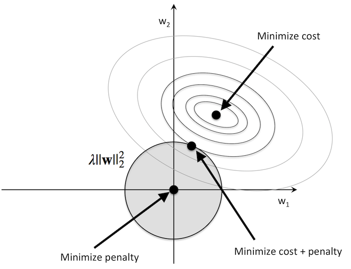

# Regularization of Generalized Linear Models

## Overview

We can understand regularization as an approach of adding an additional bias to a model to reduce the degree of overfitting in models that suffer from high variance. By adding regularization terms to the cost function, we penalize large model coefficients (weights); effectively, we are reducing the complexity of the model.

## L2 regularization

In L2 regularization, we shrink the weights by computing the Euclidean norm of the weight coefficients (the weight vector $\mathbf{w}$); $\lambda$ is the regularization parameter to be optimized.

$$L2: \lambda\; \lVert \mathbf{w} \lVert_2 = \lambda \sum_{j=1}^{m} w_j^2$$

For example, we can regularize the sum of squared errors cost function (SSE) as follows:
$$SSE =  \sum^{n}_{i=1} \big(\text{target}^{(i)} - \text{output}^{(i)}\big)^2 + L2$$

Intuitively, we can think of regression as an additional penalty term or constraint as shown in the figure below. Without regularization, our objective is to find the global cost minimum. By adding a regularization penalty, our objective becomes to minimize the cost function under the constraint that we have to stay within our "budget" (the gray-shaded ball).

In addition, we can control the regularization strength via the regularization
parameter $\lambda$. The larger the value of $\lambda$, the stronger the regularization of the model. The weight coefficients approach 0 when $\lambda$ goes towards infinity.

## L1 regularization

In L1 regularization, we shrink the weights using the absolute values of the weight coefficients (the weight vector $\mathbf{w}$); $\lambda$ is the regularization parameter to be optimized.

$$L1: \lambda \; \lVert\mathbf{w}\rVert_1 = \lambda \sum_{j=1}^{m} |w_j|$$

For example, we can regularize the sum of squared errors cost function (SSE) as follows:
$$SSE =  \sum^{n}_{i=1} \big(\text{target}^{(i)} - \text{output}^{(i)}\big)^2 + L1$$

At its core, L1-regularization is very similar to L2 regularization. However, instead of a quadratic penalty term as in L2, we penalize the model by the absolute weight coefficients. As we can see in the figure below, our "budget" has "sharp edges," which is the geometric interpretation of why the L1 model induces sparsity.

### References

- [1] M. Y. Park and T. Hastie. [*"L1-regularization path algorithm for generalized linear models"*](https://web.stanford.edu/~hastie/Papers/glmpath.pdf). Journal of the Royal Statistical Society: Series B (Statistical Methodology), 69(4):659–677, 2007.
- [2] A. Y. Ng. [*"Feature selection, L1 vs. L2 regularization, and rotational invariance"*](http://dl.acm.org/citation.cfm?id=1015435). In Proceedings of the twenty-first international conference on Machine learning, page 78. ACM, 2004.
