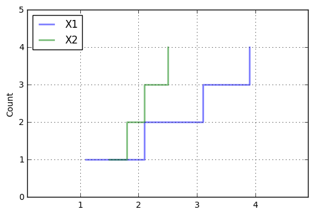

# Enrichment Plot

A function to plot step plots of cumulative counts.

> from mlxtend.general_plotting import category_scatter

## Overview

In enrichment plots, the y-axis can be interpreted as "how many samples are less or equal to the corresponding x-axis label."

### References

- -

## Example 1 - Enrichment Plots from Pandas DataFrames


```python
import pandas as pd
s1 = [1.1, 1.5]
s2 = [2.1, 1.8]
s3 = [3.1, 2.1]
s4 = [3.9, 2.5]
data = [s1, s2, s3, s4]
df = pd.DataFrame(data, columns=['X1', 'X2'])
df
```


<div>
<table border="1" class="dataframe">
  <thead>
    <tr style="text-align: right;">
      <th></th>
      <th>X1</th>
      <th>X2</th>
    </tr>
  </thead>
  <tbody>
    <tr>
      <th>0</th>
      <td>1.1</td>
      <td>1.5</td>
    </tr>
    <tr>
      <th>1</th>
      <td>2.1</td>
      <td>1.8</td>
    </tr>
    <tr>
      <th>2</th>
      <td>3.1</td>
      <td>2.1</td>
    </tr>
    <tr>
      <th>3</th>
      <td>3.9</td>
      <td>2.5</td>
    </tr>
  </tbody>
</table>
</div>


Plotting the data where the categories are determined by the unique values in the label column `label_col`. The `x` and `y` values are simply the column names of the DataFrame that we want to plot.


```python
import matplotlib.pyplot as plt
from mlxtend.plotting import enrichment_plot

ax = enrichment_plot(df, legend_loc='upper left')
```





## API


*enrichment_plot(df, colors='bgrkcy', markers=' ', linestyles='-', alpha=0.5, lw=2, where='post', grid=True, count_label='Count', xlim='auto', ylim='auto', invert_axes=False, legend_loc='best', ax=None)*

Plot stacked barplots

**Parameters**

- `df` : pandas.DataFrame

    A pandas DataFrame where columns represent the different categories.
    colors: str (default: 'bgrcky')
    The colors of the bars.

- `markers` : str (default: ' ')

    Matplotlib markerstyles, e.g,
    'sov' for square,circle, and triangle markers.

- `linestyles` : str (default: '-')

    Matplotlib linestyles, e.g.,
    '-,--' to cycle normal and dashed lines. Note
    that the different linestyles need to be separated by commas.

- `alpha` : float (default: 0.5)

    Transparency level from 0.0 to 1.0.

- `lw` : int or float (default: 2)

    Linewidth parameter.

- `where` : {'post', 'pre', 'mid'} (default: 'post')

    Starting location of the steps.

- `grid` : bool (default: `True`)

    Plots a grid if True.

- `count_label` : str (default: 'Count')

    Label for the "Count"-axis.

- `xlim` : 'auto' or array-like [min, max] (default: 'auto')

    Min and maximum position of the x-axis range.

- `ylim` : 'auto' or array-like [min, max] (default: 'auto')

    Min and maximum position of the y-axis range.

- `invert_axes` : bool (default: False)

    Plots count on the x-axis if True.

- `legend_loc` : str (default: 'best')

    Location of the plot legend
    {best, upper left, upper right, lower left, lower right}
    No legend if legend_loc=False

- `ax` : matplotlib axis, optional (default: None)

    Use this axis for plotting or make a new one otherwise

**Returns**

- `ax` : matplotlib axis


**Examples**

For usage examples, please see
    [http://rasbt.github.io/mlxtend/user_guide/plotting/enrichment_plot/](http://rasbt.github.io/mlxtend/user_guide/plotting/enrichment_plot/)


