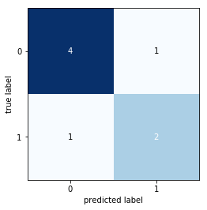
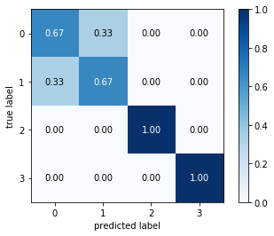

# Confusion Matrix

Utility function for visualizing confusion matrices via matplotlib

> `from mlxtend.plotting import plot_confusion_matrix`

## Overview

### Confusion Matrix

For more information on confusion matrices, please see [`mlxtend.evaluate.confusion_matrix`](../evaluate/confusion_matrix.md).

### References

- -

## Example 1 - Binary


```python
from mlxtend.plotting import plot_confusion_matrix
import matplotlib.pyplot as plt
import numpy as np

binary = np.array([[4, 1],
                   [1, 2]])

fig, ax = plot_confusion_matrix(conf_mat=binary)
plt.show()
```





## Example 2 - Binary absolute and relative with colorbar


```python
binary = np.array([[4, 1],
                   [1, 2]])

fig, ax = plot_confusion_matrix(conf_mat=binary,
                                show_absolute=True,
                                show_normed=True,
                                colorbar=True)
plt.show()
```


## Example 3 - Multiclass relative


```python
multiclass = np.array([[2, 1, 0, 0],
                       [1, 2, 0, 0],
                       [0, 0, 1, 0],
                       [0, 0, 0, 1]])

fig, ax = plot_confusion_matrix(conf_mat=multiclass,
                                colorbar=True,
                                show_absolute=False,
                                show_normed=True)
plt.show()
```





## API


*plot_confusion_matrix(conf_mat, hide_spines=False, hide_ticks=False, figsize=None, cmap=None, colorbar=False, show_absolute=True, show_normed=False)*

Plot a confusion matrix via matplotlib.
**Parameters**

- `conf_mat` : array-like, shape = [n_classes, n_classes]

    Confusion matrix from evaluate.confusion matrix.

- `hide_spines` : bool (default: False)

    Hides axis spines if True.

- `hide_ticks` : bool (default: False)

    Hides axis ticks if True

- `figsize` : tuple (default: (2.5, 2.5))

    Height and width of the figure

- `cmap` : matplotlib colormap (default: `None`)

    Uses matplotlib.pyplot.cm.Blues if `None`

- `colorbar` : bool (default: False)

    Shows a colorbar if True

- `show_absolute` : bool (default: True)

    Shows absolute confusion matrix coefficients if True.
    At least one of  `show_absolute` or `show_normed`
    must be True.

- `show_normed` : bool (default: False)

    Shows normed confusion matrix coefficients if True.
    The normed confusion matrix coefficients give the
    proportion of training examples per class that are
    assigned the correct label.
    At least one of  `show_absolute` or `show_normed`
    must be True.
**Returns**

- `fig, ax` : matplotlib.pyplot subplot objects

    Figure and axis elements of the subplot.
**Examples**

For usage examples, please see
    [http://rasbt.github.io/mlxtend/user_guide/plotting/plot_confusion_matrix/](http://rasbt.github.io/mlxtend/user_guide/plotting/plot_confusion_matrix/)


