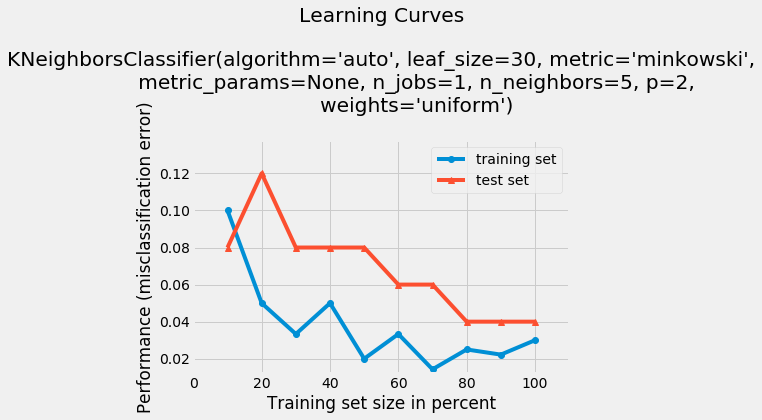

# Plotting Learning Curves

A function to plot learning curves for classifiers. Learning curves are extremely useful to analyze if a model is suffering from over- or under-fitting (high variance or high bias). The function can be imported via


> from mlxtend.plotting import plot_learning_curves

### References

-

## Example 1


```python
from mlxtend.plotting import plot_learning_curves
import matplotlib.pyplot as plt
from mlxtend.data import iris_data
from mlxtend.preprocessing import shuffle_arrays_unison
from sklearn.neighbors import KNeighborsClassifier
import numpy as np


# Loading some example data
X, y = iris_data()
X, y = shuffle_arrays_unison(arrays=[X, y], random_seed=123)
X_train, X_test = X[:100], X[100:]
y_train, y_test = y[:100], y[100:]

clf = KNeighborsClassifier(n_neighbors=5)

plot_learning_curves(X_train, y_train, X_test, y_test, clf)
plt.show()
```





## API


*plot_learning_curves(X_train, y_train, X_test, y_test, clf, train_marker='o', test_marker='^', scoring='misclassification error', suppress_plot=False, print_model=True, style='fivethirtyeight', legend_loc='best')*

Plots learning curves of a classifier.

**Parameters**

- `X_train` : array-like, shape = [n_samples, n_features]

    Feature matrix of the training dataset.

- `y_train` : array-like, shape = [n_samples]

    True class labels of the training dataset.

- `X_test` : array-like, shape = [n_samples, n_features]

    Feature matrix of the test dataset.

- `y_test` : array-like, shape = [n_samples]

    True class labels of the test dataset.

- `clf` : Classifier object. Must have a .predict .fit method.


- `train_marker` : str (default: 'o')

    Marker for the training set line plot.

- `test_marker` : str (default: '^')

    Marker for the test set line plot.

- `scoring` : str (default: 'misclassification error')

    If not 'misclassification error', accepts the following metrics
    (from scikit-learn):
    {'accuracy', 'average_precision', 'f1_micro', 'f1_macro',
    'f1_weighted', 'f1_samples', 'log_loss',
    'precision', 'recall', 'roc_auc',
    'adjusted_rand_score', 'mean_absolute_error', 'mean_squared_error',
    'median_absolute_error', 'r2'}

- `suppress_plot=False` : bool (default: False)

    Suppress matplotlib plots if True. Recommended
    for testing purposes.

- `print_model` : bool (default: True)

    Print model parameters in plot title if True.

- `style` : str (default: 'fivethirtyeight')

    Matplotlib style

- `legend_loc` : str (default: 'best')

    Where to place the plot legend:
    {'best', 'upper left', 'upper right', 'lower left', 'lower right'}

**Returns**

- `errors` : (training_error, test_error): tuple of lists


**Examples**

For usage examples, please see
    [http://rasbt.github.io/mlxtend/user_guide/plotting/learning_curves/](http://rasbt.github.io/mlxtend/user_guide/plotting/learning_curves/)


