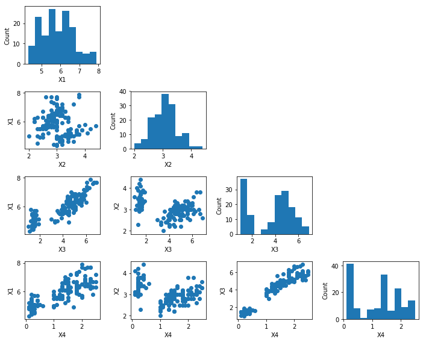
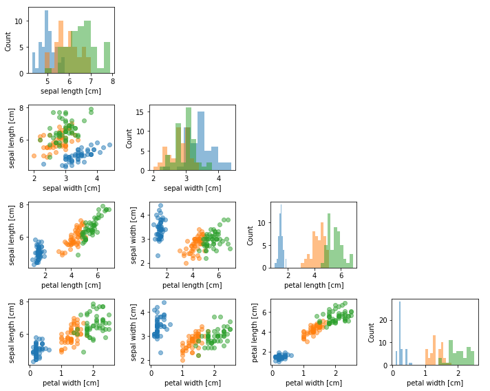

# Scatter Plot Matrix

A function to conveniently plot stacked bar plots in matplotlib using pandas `DataFrame`s. 

> from mlxtend.plotting import scatterplotmatrix

## Overview

A matplotlib convenience function for creating a scatterplot matrix.

### References

- -

## Example 1 - Simple Scatter Plot Matrix


```python
import matplotlib.pyplot as plt
from mlxtend.data import iris_data
from mlxtend.plotting import scatterplotmatrix


X, y = iris_data()
scatterplotmatrix(X, figsize=(10, 8))
plt.tight_layout()
plt.show()
```





## Example 2 - Scatter Plot Matrix with Multiple Categories


```python
names = ['sepal length [cm]', 'sepal width [cm]',
         'petal length [cm]', 'petal width [cm]']

fig, axes = scatterplotmatrix(X[y==0], figsize=(10, 8), alpha=0.5)
fig, axes = scatterplotmatrix(X[y==1], fig_axes=(fig, axes), alpha=0.5)
fig, axes = scatterplotmatrix(X[y==2], fig_axes=(fig, axes), alpha=0.5, names=names)

plt.tight_layout()
plt.show()
```





## API


*scatterplotmatrix(X, fig_axes=None, names=None, figsize=(8, 8), alpha=1.0, **kwargs)*

Lower triangular of a scatterplot matrix

**Parameters**

- `X` : array-like, shape={num_examples, num_features}

    Design matrix containing data instances (examples)
    with multiple exploratory variables (features).


- `fix_axes` : tuple (default: None)

    A `(fig, axes)` tuple, where fig is an figure object
    and axes is an axes object created via matplotlib,
    for example, by calling the pyplot `subplot` function
    `fig, axes = plt.subplots(...)`


- `names` : list (default: None)

    A list of string names, which should have the same number
    of elements as there are features (columns) in `X`.


- `figsize` : tuple (default: (8, 8))

    Height and width of the subplot grid. Ignored if
    fig_axes is not `None`.


- `alpha` : float (default: 1.0)

    Transparency for both the scatter plots and the
    histograms along the diagonal.


- `**kwargs` : kwargs

    Keyword arguments for the scatterplots.

**Returns**

- `fix_axes` : tuple

    A `(fig, axes)` tuple, where fig is an figure object
    and axes is an axes object created via matplotlib,
    for example, by calling the pyplot `subplot` function
    `fig, axes = plt.subplots(...)`


